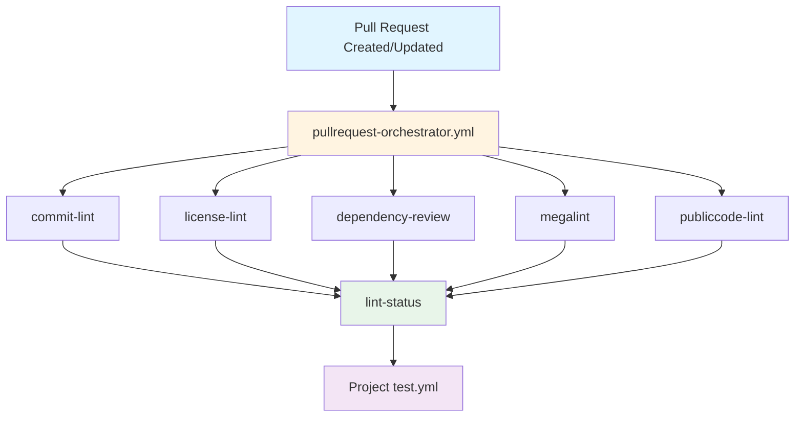
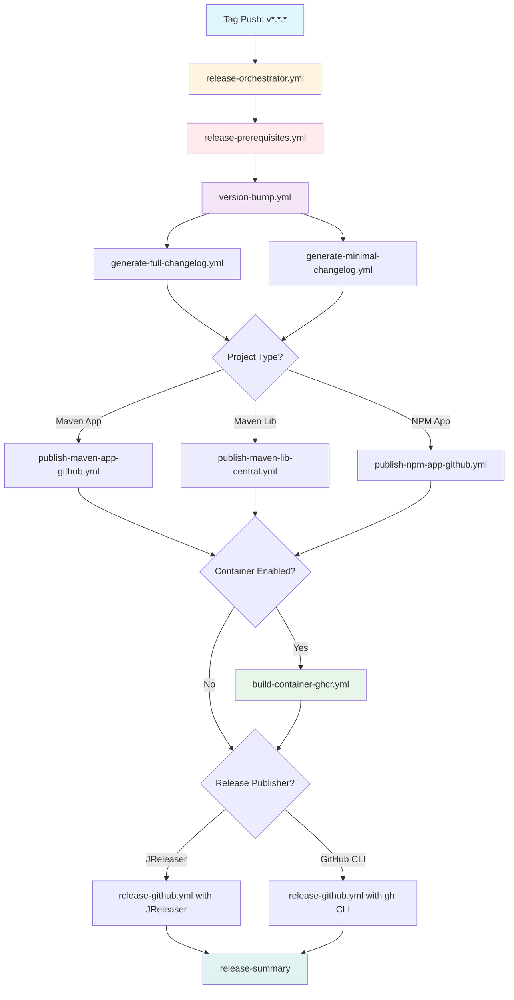
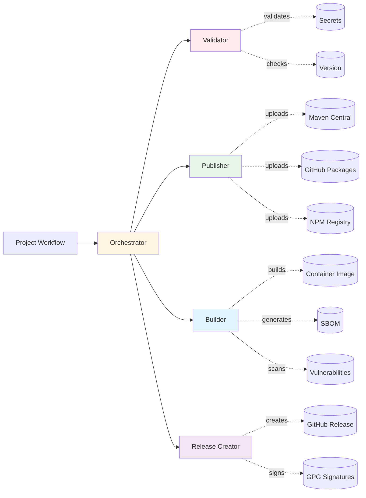
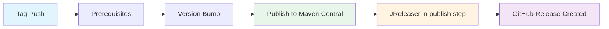
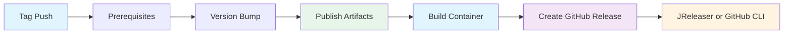

# GitHub Workflows Documentation

## Table of Contents
- [Introduction for New Users](#introduction-for-new-users)
- [Workflow Architecture](#workflow-architecture)
- [JReleaser Integration Patterns](#jreleaser-integration-patterns)
- [Quick Start](#quick-start)
- [Pull Request Workflow](#pull-request-workflow)
- [Release Workflow](#release-workflow)
- [Development Container Workflow](#development-container-workflow)
- [Available Components](#available-components)
- [Environment Variables Matrix](#environment-variables-matrix)
- [Prerequisites Check Matrix](#prerequisites-check-matrix)
- [Permission Requirements Matrix](#permission-requirements-matrix)
- [Getting Access to Secrets](#getting-access-to-secrets)
- [Complete Workflow Reference](#complete-workflow-reference)
- [Examples](#examples)
- [Version Tag Format](#version-tag-format)
- [Local Testing](#local-testing)

## Introduction for New Users

This repository contains reusable GitHub Actions workflows for DiggSweden projects. These workflows provide pre-built CI/CD pipelines following Open Source practices.

### Core Concepts

Currently, there are **two main workflow chains**:

1. **Pull Request Chain** - Runs on every PR and push
   - Linting and code quality checks
   - Security scanning
   - License compliance
   - Build verification
   - Optional testing - every project provides this on their own

2. **Release Chain** - Runs when you create and push version tag
   - Version validation (including tag requirements)
   - Artifact building and publishing
   - Container image creation
   - Security features (SBOM, signing, attestation)
   - Changelog generation
   - GitHub release creation
   - Dependency caching between jobs
   - Enhanced build summaries

### Flexibility

All components are configurable:
- **Use complete chains** - Full functionality with minimal configuration
- **Disable specific features** - Skip linters, disable signing, remove SBOM generation
- **Use individual components** - Build custom workflows using specific components
- **Combine approaches** - Use specific builders with custom release processes
- **Custom implementation** - Requires: security scanning, license compliance, SBOM generation, artifact signing, SLSA attestation

---

## Workflow Architecture

### Pull Request Workflow Architecture



### Release Workflow Architecture



### Component Interaction Flow



### Workflow Execution Patterns

#### Pattern 1: Maven Library (cose-lib)


#### Pattern 2: Maven/NPM Application with Container (issuer-poc, linter)


### Key Differences Explained

| Aspect | Library Pattern | Application Pattern |
|--------|----------------|---------------------|
| **Artifacts** | JAR, Sources, Javadoc | JAR/NPM + Container Image |
| **Destination** | Maven Central | GitHub Packages + ghcr.io |
| **JReleaser Timing** | During Maven publish | After all artifacts ready |
| **Container Build** | Not needed | Required |
| **Release Step** | Integrated in publish | Separate final step |

---

### Getting Started

Most projects require two or three files:

1. **`.github/workflows/pullrequest-workflow.yml`** - For PR checks
2. **`.github/workflows/release-workflow.yml`** - For production releases
3. **`.github/workflows/release-workflow-dev.yml`** - (Optional) For dev/feature branch releases

Simple Maven based example
```yaml
# pullrequest-workflow.yml
name: Pull Request Workflow

on:
  pull_request:
    branches:
      - main
      - master
      - develop
      - 'release/**'  # Matches release/1.0, release/2.0, etc.
      - 'feature/**'  # Matches feature/new-api, feature/fix-bug, etc.

permissions:
  contents: read  # Default permission for all jobs

jobs:
  pr-checks:
    uses: diggsweden/.github/.github/workflows/pullrequest-orchestrator.yml@main
    secrets: inherit  # Pass org-level secrets (for private package access)
    permissions:
      contents: read         # Clone and read repository code
      packages: read         # Download packages from GitHub Packages
      security-events: write # Upload security scan results to GitHub
    with:
      projectType: maven
```

```yaml
# release-workflow-dev.yml (Optional - for dev/feature branches)
name: Release Workflow Dev

on:
  push:
    branches:
      - 'dev/**'
      - 'feat/**'
  workflow_dispatch:

permissions:
  contents: read

jobs:
  dev-release:
    uses: diggsweden/.github/.github/workflows/release-dev-orchestrator.yml@main
    permissions:
      contents: write  # Create version bump commits
      packages: write  # Push dev container images
    secrets: inherit
    with:
      projectType: maven
```

**When to use dev workflow:**
- Automatic dev releases on dev/feat branches
- Creates container images tagged with branch name (e.g., `1.2.3-dev-feat-awesome-abc1234`)
- Tests release process before production
- Enables testing of container images from feature branches

### Prerequisites

Some features require secrets to be configured:
- **GPG signing** needs GPG keys
- **Maven Central** needs Sonatype credentials  
- **Container registries** use GITHUB_TOKEN (automatic)

**Important for DiggSweden projects:** All required secrets are configured at the DiggSweden organization level. Request access from DiggSweden GitHub administrators to enable secrets for the repository.

Not using these features? No need to request the secrets.

### How It Works

1. **Push code** → PR workflow runs checks
2. **Create version tag** → Release workflow builds and publishes
3. **Workflow failures** → Detailed error messages

The workflows handle all the complexity:
- Multi-platform container builds
- Security scanning and attestation
- Artifact signing and checksums
- Version management
- Changelog generation

### Customization Levels

#### Option 1: Use Everything
```yaml
uses: diggsweden/.github/.github/workflows/release-orchestrator.yml@main
with:
  projectType: maven
  artifactPublisher: maven-app-github
  containerBuilder: containerimage-ghcr
  releasePublisher: jreleaser
```

#### Option 2: Configure What You Need
```yaml
uses: diggsweden/.github/.github/workflows/release-orchestrator.yml@main
with:
  projectType: npm
  containerBuilder: containerimage-ghcr  # Only build containers
  # Skip artifact publishing and release creation
```

#### Option 3: Build Your Own Flow
```yaml
jobs:
  my-build:
    # Your custom steps
    
  my-container:
    needs: my-build
    uses: diggsweden/.github/.github/workflows/build-container-ghcr.yml@main
    # Use just the container builder
```

#### Option 4: Complete Custom Implementation
```yaml
# Not using any of our workflows
jobs:
  custom-everything:
    # Your own implementation
    #  But you implement:
    # - Security scanning (Trivy, Grype, etc.)
    # - License compliance checking
    # - SBOM generation (CycloneDX/SPDX)
    # - Artifact signing (GPG/Cosign)
    # - SLSA provenance attestation
    # - Dependency vulnerability scanning
    # - Secret detection
    # ...to meet organizational security and compliance requirements
```

### Next Steps

1. **Select project type** - Maven or NPM
2. **Copy an example** - See Quick Start
3. **Configure secrets** - See Environment Variables Matrix
4. **Customize settings** - Enable/disable features
5. **Test with pre-release** - Use `v1.0.0-test.1` format

### Tag Requirements

For releases to work properly, tags must be:
1. **Semantic versioned** - Format: `vMAJOR.MINOR.PATCH[-PRERELEASE]`
2. **Annotated** - Created with `git tag -a` (not lightweight tags)
3. **Signed** - Created with `git tag -s` (GPG) or SSH signed

Examples:
```bash
# Create a signed, annotated tag
git tag -s v1.0.0 -m "Release v1.0.0"

# Create an annotated tag (unsigned)
git tag -a v1.0.0 -m "Release v1.0.0"

# Push the tag
git push origin v1.0.0
```

Accepted tag patterns:
- `v1.0.0` - Stable release
- `v1.0.0-alpha.1` - Alpha pre-release
- `v1.0.0-beta.1` - Beta pre-release  
- `v1.0.0-rc.1` - Release candidate
- `v1.0.0-snapshot` - Snapshot build
- `v1.0.0-SNAPSHOT` - Snapshot build (uppercase)

Note: Tags ending with `-dev` are excluded from release workflows to prevent accidental dev releases.

---

## JReleaser Integration Patterns

JReleaser is used differently depending on your project type. Understanding when and how JReleaser runs is critical for correct configuration.

### Pattern 1: Library Publishing (Maven Central)

**Used by:** Maven libraries published to Maven Central (e.g., `cose-lib`)

**How it works:**
```yaml
# release-workflow.yml
with:
  artifactPublisher: maven-lib-mavencentral
  artifact.jreleaserenabled: true
  # No releasePublisher configured
```

**JReleaser runs DURING the Maven publish step:**
```
1. Version bump
2. Publish to Maven Central
   └─ mvn deploy (publishes to Central)
   └─ mvn jreleaser:full-release (creates GitHub release)
3. Done (no separate release step)
```

**Why this pattern:**
- Libraries typically only publish JARs (no containers)
- JReleaser is configured as a Maven plugin in `pom.xml`
- GitHub release creation happens as part of publishing
- Single-step deployment to both Central and GitHub

**Configuration required:**
```xml
<!-- In pom.xml -->
<plugin>
  <groupId>org.jreleaser</groupId>
  <artifactId>jreleaser-maven-plugin</artifactId>
  <version>${jreleaser-maven-plugin.version}</version>
  <configuration>
    <configFile>${project.basedir}/jreleaser.yml</configFile>
  </configuration>
</plugin>
```

**Example repositories:**
- `cose-lib` - See `.github/workflows/release-workflow.yml`

---

### Pattern 2: Application Publishing (with Container Images)

**Used by:** Applications that build both artifacts AND containers (e.g., `eudiw-wallet-issuer-poc`, `rest-api-profil-lint-processor`)

**How it works:**
```yaml
# release-workflow.yml
with:
  artifactPublisher: maven-app-github  # or npm-app-github
  containerBuilder: containerimage-ghcr
  releasePublisher: jreleaser  # or github-cli
```

**JReleaser runs AFTER all artifacts are ready:**
```
1. Version bump
2. Publish artifacts (JAR or NPM)
3. Build container image
4. Create GitHub release
   └─ JReleaser or GitHub CLI creates release
   └─ Attaches JAR + container reference + SBOM
```

**Why this pattern:**
- Applications need both artifacts AND containers
- Container must be built before creating release
- Release notes need to reference container image
- GitHub release is created after ALL artifacts ready

**When to use JReleaser vs GitHub CLI:**
- **JReleaser:** Maven projects with complex artifact sets
- **GitHub CLI:** NPM projects or simpler releases

**Example repositories:**
- `eudiw-wallet-issuer-poc` - Maven app with JReleaser
- `rest-api-profil-lint-processor` - NPM app with GitHub CLI

---

### Decision Tree: Which Pattern Should I Use?

```
Is this a library or application?
├─ Library
│  └─ Publishing to Maven Central?
│     ├─ Yes → Use Pattern 1 (JReleaser in publish step)
│     └─ No → Use Pattern 2 (separate release step)
│
└─ Application
   └─ Building container images?
      ├─ Yes → Use Pattern 2 (JReleaser after container)
      └─ No → Either pattern works (Pattern 2 recommended)
```

### Key Differences

| Aspect | Pattern 1 (Library) | Pattern 2 (Application) |
|--------|-------------------|------------------------|
| **When JReleaser runs** | During `mvn deploy` | After container build |
| **JReleaser location** | Maven plugin | Workflow step |
| **Artifacts included** | JAR, sources, javadoc | JAR/NPM + container + SBOM |
| **Container builds** | No | Yes (before release) |
| **Typical destination** | Maven Central + GitHub | GitHub Packages + ghcr.io |
| **Release step** | Integrated | Separate final step |

### Common Mistakes

**❌ Wrong: Using Pattern 1 for applications with containers**
```yaml
# This doesn't work if you build containers!
artifactPublisher: maven-app-github
artifact.jreleaserenabled: true  # ← JReleaser runs too early
containerBuilder: containerimage-ghcr  # ← Container built AFTER release created
```

**Problem:** GitHub release is created before container exists, so container can't be referenced in release notes.

**✅ Correct: Using Pattern 2 for applications with containers**
```yaml
artifactPublisher: maven-app-github
containerBuilder: containerimage-ghcr
releasePublisher: jreleaser  # ← JReleaser runs AFTER container ready
```

---

## ⚠️ Important: Permissions in Reusable Workflows

### GitHub Limitation

Due to a GitHub Actions limitation, you **MUST explicitly declare permissions** in your workflow file when calling reusable workflows. The orchestrator cannot automatically grant permissions to its nested workflow calls.

**Why this happens:** GitHub doesn't support dynamic permission inheritance across nested reusable workflow calls. Since our orchestrators call multiple sub-workflows (version-bump, publish, container-build, release), each requiring different permissions, there's no way to make this automatic.

**Solution:** Copy the exact permissions shown in the examples below. These permissions are the minimum required for the orchestrator to function correctly.

### Required Permissions by Workflow Type

#### Pull Request Workflows
```yaml
permissions:
  contents: read         # Clone and read repository code
  packages: read         # Download packages from GitHub Packages
  security-events: write # Upload security scan results to GitHub
```

#### Release Workflows
```yaml
permissions:
  contents: write         # Create GitHub releases and tags
  packages: write         # Publish artifacts and containers to GitHub
  id-token: write        # Generate OIDC token for attestations
  actions: read          # Read workflow for SLSA provenance
  security-events: write # Upload container scan results
  attestations: write    # Attach SBOM to container images
```

#### Dev Release Workflows
```yaml
permissions:
  contents: write   # Version bump commits
  packages: write   # Push dev containers to ghcr.io
```

**References:**
- [GitHub Docs: Reusable Workflows Permissions](https://docs.github.com/en/actions/using-workflows/reusing-workflows#supported-keywords-for-jobs-that-call-a-reusable-workflow)
- [GitHub Community Discussion #40974](https://github.com/orgs/community/discussions/40974)
- [GitHub Community Discussion #26823](https://github.com/orgs/community/discussions/26823)

---

## Quick Start

### Basic PR Workflow
```yaml
# .github/workflows/pullrequest-workflow.yml
name: Pull Request Workflow

on:
  pull_request:
    branches:
      - main
      - master
      - develop
      - 'release/**'  # Matches release/1.0, release/2.0, etc.
      - 'feature/**'  # Matches feature/new-api, feature/fix-bug, etc.

permissions:
  contents: read  # Best Security practice. Jobs only get read as base, and then permissions are added as needed

jobs:
  pr-checks:
    uses: diggsweden/.github/.github/workflows/pullrequest-orchestrator.yml@main
    secrets: inherit  # Pass org-level secrets (for private package access)
    permissions:
      contents: read         # Clone and read repository code
      packages: read         # Download packages from GitHub Packages
      security-events: write # Upload security scan results to GitHub
    with:
      projectType: maven  # Build system: maven (Java/Spring) or npm (Node.js/JavaScript)
```

### Basic Release Workflow
```yaml
# .github/workflows/release-workflow.yml
name: Release Workflow

on:
  push:
    tags:
      - "v[0-9]+.[0-9]+.[0-9]+"              # Stable: v1.0.0
      - "v[0-9]+.[0-9]+.[0-9]+-alpha*"       # Alpha: v1.0.0-alpha.1
      - "v[0-9]+.[0-9]+.[0-9]+-beta*"        # Beta: v1.0.0-beta.1
      - "v[0-9]+.[0-9]+.[0-9]+-rc*"          # RC: v1.0.0-rc.1
      - "v[0-9]+.[0-9]+.[0-9]+-snapshot*"    # Snapshot: v1.0.0-snapshot
      - "v[0-9]+.[0-9]+.[0-9]+-SNAPSHOT*"    # Snapshot: v1.0.0-SNAPSHOT

concurrency:
  group: release-${{ github.ref }}
  cancel-in-progress: false  # Queue releases, don't cancel partial releases

permissions:
  contents: read  # Best Security practice. Jobs only get read as base, and then permissions are added as needed

jobs:
  release:
    uses: diggsweden/.github/.github/workflows/release-orchestrator.yml@main
    secrets: inherit  # Use org-level GPG keys and publishing credentials
    permissions:
      contents: write         # Create GitHub releases and tags
      packages: write         # Publish artifacts and containers to GitHub
      id-token: write        # Generate OIDC token for attestations
      actions: read          # Read workflow for SLSA provenance
      security-events: write # Upload container scan results
      attestations: write    # Attach SBOM to container images
    with:
      projectType: maven
      artifactPublisher: maven-app-github  # Publishes JAR to GitHub Packages
      containerBuilder: containerimage-ghcr  # Creates Docker image in ghcr.io
      releasePublisher: jreleaser  # Creates GitHub release with changelog
```

### Dev Release Workflow Example
```yaml
# .github/workflows/release-workflow-dev.yml
name: Dev Release

on:
  push:
    branches:
      - 'dev/**'   # Matches dev/feature-x, dev/fix-y
      - 'feat/**'  # Matches feat/new-api, feat/cool-stuff

permissions:
  contents: read

jobs:
  dev-release:
    uses: diggsweden/.github/.github/workflows/release-dev-orchestrator.yml@main
    permissions:
      contents: write   # Version bump commits
      packages: write   # Push dev containers to ghcr.io
    with:
      projectType: maven  # or npm
    secrets: inherit
```

**Dev Release Features:**
- ✅ Version bump with `-dev` suffix (e.g., `1.2.4-dev.1`)
- ✅ Multi-arch container with `dev-<branch>-<sha>` tag (e.g., `0.5.9-dev-feat-awesome-cdb5e47`)
- ✅ Maven/NPM package publication with dev version
- ✅ Artifact summary generation
- ⏱️ 2-3 minute execution (multi-arch build with dependency caching)
- ❌ No SLSA attestations
- ❌ No SBOM generation
- ❌ No vulnerability scanning
- ❌ No GitHub release

**Triggering Dev Releases:**
```bash
# Push to a dev or feat branch
git push -u origin feat/my-feature
```

**Pull Dev Images:**
```bash
docker pull ghcr.io/diggsweden/your-project:0.5.9-dev-feat-my-feature-cdb5e47
# or
podman pull ghcr.io/diggsweden/your-project:0.5.9-dev-feat-my-feature-cdb5e47
```

---

## Pull Request Workflow

Quality checks executed on pull requests and pushes.

### Workflow Steps
1. **Linting** - Code style and quality validation
2. **License Scanning** - License compliance verification
3. **Security Scanning** - SAST and dependency analysis
4. **Build** - Project compilation
5. **Tests** - Unit test execution (when test job is chained)

### Full Configuration Example (Maven Application)
```yaml
# SPDX-FileCopyrightText: 2024 Digg - Agency for Digital Government
#
# SPDX-License-Identifier: CC0-1.0

---
name: Pull Request Workflow

on:
  pull_request:
    branches:
      - main
      - master
      - develop
      - 'release/**'  # Matches release/1.0, release/2.0, etc.
      - 'feature/**'  # Matches feature/new-api, feature/fix-bug, etc.

permissions:
  contents: read  # Best Security practice. Jobs only get read as base, and then permissions are added as needed

jobs:
  pr-checks:
    uses: diggsweden/.github/.github/workflows/pullrequest-orchestrator.yml@main
    
    # Pass organization-level secrets to the workflow
    # This enables access to private GitHub Packages if your dependencies are private
    # Without this, the workflow cannot fetch private @diggsweden/* packages
    secrets: inherit
    
    permissions:
      contents: read         # Required: Clone and read repository source code
      packages: read         # Required: Download private dependencies from GitHub Packages
      security-events: write # Required: Upload vulnerability scan results to GitHub Security tab
    
    with:
      projectType: maven  # Determines build commands and dependency management (maven/npm)
  
  test:
    needs: [pr-checks]
    
    # Always run tests regardless of linting results
    # This provides complete feedback - you see both linting issues AND test failures
    # Without this, test failures would be hidden if linting fails first
    if: always()
    
    permissions:
      contents: read  # Required: Access repository source code for test execution
      packages: read  # Required: Fetch test dependencies from GitHub Packages
    
    # Uses your local test workflow (must exist in your repository)
    # This separation allows custom test configurations per repository
    uses: ./.github/workflows/test.yml
```

### Full Configuration Example (All Options)
```yaml
name: Pull Request Workflow

on:
  pull_request:
    branches:
      - main
      - master
      - develop
      - 'release/**'  # Matches release/1.0, release/2.0, etc.
      - 'feature/**'  # Matches feature/new-api, feature/fix-bug, etc.

permissions:
  contents: read  # Best Security practice. Jobs only get read as base, and then permissions are added as needed

jobs:
  pr-checks:
    uses: diggsweden/.github/.github/workflows/pullrequest-orchestrator.yml@main
    
    # Pass organization-level secrets to the workflow
    # Required for accessing private @diggsweden/* packages in GitHub Packages
    # Without this, builds fail if you depend on internal private libraries
    secrets: inherit
    
    permissions:
      contents: read          # Required: Clone repository and read source code
      packages: read          # Required: Access private packages from GitHub Packages registry
      security-events: write  # Required: Upload security findings to GitHub's Security tab
    
    with:
      # REQUIRED PARAMETERS
      projectType: maven              # Required. Valid: maven, npm
      
      # OPTIONAL PARAMETERS (shown with defaults)
      baseBranch: main               # Default: main. Base branch for commit linting
      
      # LINTER CONTROLS (all default to true except publiccodelint)
      linters.commitlint: true       # Default: true. Validates commit messages follow conventions
      linters.licenselint: true      # Default: true. Validates SPDX license headers
      linters.dependencyreview: true # Default: true. Checks for vulnerable dependencies
      linters.megalint: true         # Default: true. Runs 50+ code quality linters
      linters.publiccodelint: false  # Default: false. Validates publiccode.yml (for open source)
      
  test:
    needs: [pr-checks]
    
    # Always run tests regardless of linting results
    # This ensures you get complete CI feedback in one run
    if: always()
    
    permissions:
      contents: read  # Required: Read source code to run tests
      packages: read  # Required: Download test dependencies from GitHub Packages
    
    # Your custom test workflow - keeps test logic separate and maintainable
    uses: ./.github/workflows/test.yml
```

### Supported Project Types
- `maven` - Java projects with pom.xml
- `npm` - Node.js projects with package.json

---

## Release Workflow

Complete release process triggered by version tags.

### Release Steps
1. **Version Validation** - Tag and project version matching
2. **Build Artifacts** - JAR and NPM package creation
3. **Container Images** - Docker image build and registry push
4. **Security** - SBOM generation, artifact signing, SLSA attestation
5. **Changelog** - Release notes via git-cliff
6. **GitHub Release** - Release creation with assets
7. **Publishing** - Deployment to Maven Central, NPM, GitHub Packages

### Full Configuration Example (With Defaults)
```yaml
name: Release Workflow

on:
  push:
    tags:
      - "v[0-9]+.[0-9]+.[0-9]+"              # Stable: v1.0.0
      - "v[0-9]+.[0-9]+.[0-9]+-alpha*"       # Alpha: v1.0.0-alpha.1
      - "v[0-9]+.[0-9]+.[0-9]+-beta*"        # Beta: v1.0.0-beta.1
      - "v[0-9]+.[0-9]+.[0-9]+-rc*"          # RC: v1.0.0-rc.1
      - "v[0-9]+.[0-9]+.[0-9]+-snapshot*"    # Snapshot: v1.0.0-snapshot
      - "v[0-9]+.[0-9]+.[0-9]+-SNAPSHOT*"    # Snapshot: v1.0.0-SNAPSHOT

permissions:
  contents: read  # Best Security practice. Jobs only get read as base, and then permissions are added as needed

jobs:
  release:
    uses: diggsweden/.github/.github/workflows/release-orchestrator.yml@main
    secrets: inherit
    permissions:
      contents: write       # Create GitHub releases and tags
      packages: write       # Push packages to GitHub Packages/ghcr.io
      id-token: write      # Generate OIDC token for SLSA provenance
      attestations: write  # Attach SBOM attestations to containers
      security-events: write
    with:
      projectType: maven
      
      # === PUBLISHERS & BUILDERS ===
      # Artifact Publisher - Choose based on your package type:
      artifactPublisher: maven-app-github        # Publishes JAR/WAR to GitHub Packages
      # artifactPublisher: maven-lib-mavencentral # For libraries going to Maven Central (needs credentials)
      # artifactPublisher: npm-app-github         # Publishes to GitHub NPM registry
      
      containerBuilder: containerimage-ghcr      # Creates multi-arch Docker images in ghcr.io
      
      changelogCreator: git-cliff                # Generates changelog from commit messages
      
      # Release Publisher - Platform-specific:
      releasePublisher: jreleaser               # Uses JReleaser (best for Java projects)
      # releasePublisher: github-cli            # Uses GitHub CLI (best for Node.js projects)
      
      # === ARTIFACT SETTINGS (showing defaults) ===
      artifact.javaversion: "21"                # Default: "21". JDK version for Maven builds
      artifact.nodeversion: "22"                # Default: "22". Node.js version for NPM builds  
      artifact.attachpattern: "target/*.jar"    # Default: "target/*.jar". Files to attach to release
      artifact.npmtag: "latest"                 # Default: "latest". NPM dist-tag
      # artifact.settingspath: ".mvn/settings.xml" # No default. Custom Maven settings path
      artifact.jreleaserenabled: false          # Default: false. Enable JReleaser Maven plugin
      
      # === CONTAINER SETTINGS (showing defaults) ===
      container.registry: "ghcr.io"             # Default: "ghcr.io". Container registry
      container.platforms: "linux/amd64,linux/arm64"  # Default: "linux/amd64,linux/arm64". Target platforms
      container.enableslsa: true                # Default: true. SLSA provenance attestation
      container.enablesbom: true                # Default: true. Generate SBOM
      container.enablescan: true                # Default: true. Trivy vulnerability scan
      container.containerfile: "Containerfile"  # Default: "Containerfile". Dockerfile path
      
      # === CHANGELOG SETTINGS (showing defaults) ===
      changelogCreator: "git-cliff"             # Default: "git-cliff". Changelog generator
      changelog.config: ".github-templates/gitcliff-templates/keepachangelog.toml" # Default template
      changelog.skipversionbump: false          # Default: false. Skip version bump
      
      # === RELEASE SETTINGS (showing defaults) ===
      # releasePublisher: jreleaser             # No default. Choose jreleaser or github-cli
      release.config: "jreleaser.yml"           # Default: "jreleaser.yml". JReleaser config
      release.generatesbom: true                # Default: true. Generate SBOM for release
      release.signartifacts: true               # Default: true. GPG sign artifacts
      release.checkauthorization: false         # Default: false. Check user authorization
      release.draft: false                      # Default: false. Create draft release
      # releaseType: stable                     # Auto-detected from tag (v1.0.0=stable, v1.0.0-beta=prerelease)
      branch: "main"                             # Default: "main". Base branch for changelog
      
      # === ADVANCED SETTINGS (showing defaults) ===
      workingDirectory: "."                     # Default: ".". Working directory
      # file_pattern: Auto-detected based on projectType (Maven: "CHANGELOG.md pom.xml", NPM: "CHANGELOG.md package.json package-lock.json")
      
      # Note: The following features are automatically handled by the workflows:
      # - File pattern detection based on project type (Maven, NPM, Gradle, Python)
      # - SHA-256 checksums in checksums.sha256 (generated by JReleaser or GitHub CLI)
      # - GPG signing (when OSPO_BOT_GPG_* secrets are configured)
      # - SLSA/SBOM catalogs (controlled by container.enableslsa and release.generatesbom)
```

### Release Types

#### Production Release
Triggered by version tags without suffix:
- `v1.0.0` → Production release
- `v2.3.4` → Production release

#### Pre-release Types
Triggered by version tags with specific suffixes:
- `v1.0.0-alpha.1` → Alpha pre-release
- `v1.0.0-beta.1` → Beta pre-release  
- `v1.0.0-rc.1` → Release candidate
- `v1.0.0-snapshot` → Snapshot release
- `v1.0.0-SNAPSHOT` → Snapshot release (Maven style)

#### Excluded Tags
The following tags will NOT trigger releases:
- `v1.0.0-dev` → Development builds (use branch triggers instead)
- `v1.0.0-test` → Test builds
- `v1.0.0-anything-else` → Any other suffix not explicitly allowed

---

## Development Container Workflow

Container builds for development environments.

### What It Does
- **Version bump** - Adds `-dev` suffix (e.g., `1.2.4-dev.1`)
- **Builds project** - Maven/NPM build with dependency caching
- **Creates container** - Multi-platform (linux/amd64, linux/arm64)
- **Pushes to registry** - With branch-aware tags (e.g., `0.5.9-dev-feat-awesome-cdb5e47`)
- **Publishes packages** - Maven/NPM artifacts with dev version
- **Generates summary** - Shows all created artifacts
- **Fast execution** - Completes in 2-3 minutes with multi-arch
- ❌ **Skips production features** - No SLSA, SBOM, signing, or GitHub release

### Configuration
```yaml
# .github/workflows/release-workflow-dev.yml
name: Dev Release

on:
  push:
    branches:
      - 'dev/**'   # Matches dev/feature-x, dev/fix-y
      - 'feat/**'  # Matches feat/new-api, feat/cool-stuff

permissions:
  contents: read

jobs:
  dev-release:
    uses: diggsweden/.github/.github/workflows/release-dev-orchestrator.yml@main
    permissions:
      contents: write   # Version bump commits
      packages: write   # Push dev containers to ghcr.io
    with:
      projectType: maven  # or npm
    secrets: inherit
```

### Triggering Dev Releases
```bash
# Push to a dev or feat branch
git push origin feat/my-feature
```

### Output
Creates containers with branch-aware dev tags:
- `ghcr.io/diggsweden/your-repo:0.5.9-dev-feat-awesome-abc1234`

Pull the image:
```bash
podman pull ghcr.io/diggsweden/your-repo:0.5.9-dev-feat-awesome-abc1234
```

---

## Available Components

You can use individual components instead of the full orchestrators.

### Component Overview Matrix

#### Artifact Publishers
| Component | Purpose | Output | Required Secrets | Use When |
|-----------|---------|--------|------------------|----------|
| **maven-app-github** | Publishes Maven JARs to GitHub Packages | JAR artifacts in GitHub Packages | GITHUB_TOKEN | Java apps for internal distribution |
| **maven-lib-mavencentral** | Publishes Maven libraries to Maven Central | Public Maven artifacts | MAVENCENTRAL_USERNAME, MAVENCENTRAL_PASSWORD | Open source Java libraries |
| **npm-app-github** | Publishes NPM packages to GitHub registry | NPM packages in GitHub Packages | NPM_TOKEN | Node.js apps/libs for internal use |

#### Container Builders
| Component | Purpose | Features | Build Time | Use When |
|-----------|---------|----------|------------|----------|
| **containerimage-ghcr** | Production multi-platform container builds | SLSA attestation, SBOM, vulnerability scanning, multi-arch | ~10-15 min | Production releases |
| **containerimage-ghcr-dev** | Fast single-platform dev builds | Basic image only, SHA-based tags | ~2-3 min | Development/testing |

#### Release Tools
| Component | Purpose | Creates/Updates | Required Secrets | Use When |
|-----------|---------|----------------|------------------|----------|
| **jreleaser** | Automated GitHub releases | GitHub release, changelog, signatures | RELEASE_TOKEN, GPG keys | Any production release |
| **github-release** | Simple GitHub release creation | GitHub release with assets | GITHUB_TOKEN | Basic releases without JReleaser |
| **version-bump-changelog** | Version management | Updated version files, changelog | GITHUB_TOKEN | Before releases |

#### Validators
| Component | Purpose | Validates | Blocks On | Use When |
|-----------|---------|-----------|-----------|----------|
| **validate-release-prerequisites** | Pre-release checks | Version match, permissions, secrets | Any validation failure | Before any release |

> **Note:** New components are created based on requests and needs. Currently planned for the near future:
> - **Monorepo support** - Build multiple services/packages from a single repository
> - **Gradle support** - For Gradle-based Java/Kotlin projects
> - **NPM library publisher** - For publishing NPM libraries (not just applications)
> 
> To request a new component, open an issue in the `.github` repository.

### Publishers

#### `maven-app-github`
Publishes Maven applications to GitHub Packages.
```yaml
uses: ./.github/workflows/publish-maven-app-github.yml
with:
  javaVersion: "21"        # JDK version (17, 21, etc.)
  workingDirectory: "."    # Subdirectory containing pom.xml
  branch: main             # Branch to checkout for build
  attachPattern: "target/*.jar"  # Files to attach to release (supports wildcards)
```

#### `maven-lib-mavencentral`
Publishes Maven libraries to Maven Central.
```yaml
uses: ./.github/workflows/publish-maven-lib-central.yml
with:
  javaVersion: "21"
  workingDirectory: "."
  settingsPath: ".mvn/settings.xml"  # Maven settings with Central credentials
  jreleaserEnabled: true              # Use JReleaser plugin from pom.xml
```

#### `npm-app-github`
Publishes NPM packages to GitHub Packages.
```yaml
uses: ./.github/workflows/publish-npm-app-github.yml
with:
  nodeVersion: "22"       # Node.js version (20, 22, lts/*, etc.)
  workingDirectory: "."
  npmTag: "latest"        # Distribution tag (latest, next, beta)
```

### Container Builders

#### `containerimage-ghcr`
Production container builds with full security features.
```yaml
uses: ./.github/workflows/build-container-ghcr.yml
with:
  containerfile: "Containerfile"        # Path to Container/Dockerfile
  context: "."                          # Docker build context directory
  platforms: "linux/amd64,linux/arm64"  # Multi-architecture support
  enableSLSA: true                      # Generate supply chain attestation
  enableSBOM: true                      # Embed Software Bill of Materials
  enableScan: true                      # Run vulnerability scanning with Trivy
  registry: "ghcr.io"                   # Container registry URL
```

#### `containerimage-ghcr-dev`
Fast development container builds.
```yaml
uses: ./.github/workflows/build-container-ghcr-dev.yml
with:
  containerfile: "Dockerfile"
  registry: "ghcr.io"
  projectType: maven       # Build system (determines build commands)
  workingDirectory: "."    # Where to run maven/npm build
```

### Other Components

#### `version-bump-changelog`
Handles version bumping and changelog generation.
```yaml
uses: ./.github/workflows/version-bump-changelog.yml
with:
  projectType: maven      # Determines version file (pom.xml vs package.json)
  branch: main            # Base branch for changelog comparison
  releaseType: stable     # stable or prerelease (affects version bump)
```

#### `github-release`
Creates GitHub releases with assets.
```yaml
uses: ./.github/workflows/github-release.yml
with:
  attachPattern: "target/*.jar"  # Files to upload as release assets
  generateSBOM: true              # Include CycloneDX/SPDX SBOM files
  signArtifacts: true             # GPG sign all release artifacts
```

#### `validate-release-prerequisites`
Validates release requirements.
```yaml
uses: ./.github/workflows/validate-release-prerequisites.yml
with:
  projectType: maven
  artifactPublisher: maven-app-github
  checkAuthorization: true  # Verify user has permission to release
```

---

## Complete Workflow Reference

### Workflow Files

| Workflow | Purpose | When to Use |
|----------|---------|-------------|
| `pullrequest-orchestrator.yml` | Run CI checks on PRs | Every repository |
| `release-orchestrator.yml` | Full release process | Production releases |
| `release-dev-orchestrator.yml` | Dev container builds | Development branches |
| `test.yml` | Run tests | Chain after PR checks |

### Project Structure Required

#### Maven Projects
```
your-repo/
├── pom.xml
├── src/
├── Containerfile (optional)
├── jreleaser.yml (optional)
└── .github/
    └── workflows/
        ├── pullrequest-workflow.yml
        └── release-workflow.yml
```

#### NPM Projects
```
your-repo/
├── package.json
├── package-lock.json
├── src/
├── Containerfile (optional)
└── .github/
    └── workflows/
        ├── pullrequest-workflow.yml
        └── release-workflow.yml
```

### Required Secrets and Environment Variables

## Environment Variables Matrix

| Variable/Secret | Required For | When Checked | Expected Value | Where to Set | Notes |
|-----------------|--------------|--------------|----------------|--------------|--------|
| **GITHUB_TOKEN** | All workflows | Always | Valid GitHub token | Automatic | Provided by GitHub Actions |
| **OSPO_BOT_GHTOKEN** | Release workflows | During release | GitHub PAT with repo scope | DiggSweden Org secrets | Bot token for releases |
| **OSPO_BOT_GPG_PUB** | GPG signing | During signing | GPG public key | DiggSweden Org secrets | Public key for verification |
| **OSPO_BOT_GPG_PRIV** | GPG signing | During signing | Base64 GPG private key | DiggSweden Org secrets | Private key for signing |
| **OSPO_BOT_GPG_PASS** | GPG signing | During signing | GPG key passphrase | DiggSweden Org secrets | Passphrase for GPG key |
| **MAVENCENTRAL_USERNAME** | `maven-lib-mavencentral` | During publish | Sonatype username | DiggSweden Org secrets | Maven Central auth |
| **MAVENCENTRAL_PASSWORD** | `maven-lib-mavencentral` | During publish | Sonatype password | DiggSweden Org secrets | Maven Central auth |
| **NPM_TOKEN** | `npm-app-github` | During publish | GitHub NPM token | DiggSweden Org secrets | NPM registry auth |
| **RELEASE_TOKEN** | JReleaser | During release | GitHub PAT | DiggSweden Org secrets | JReleaser operations |
| **AUTHORIZED_RELEASE_DEVELOPERS** | Production releases | Pre-release check | Comma-separated usernames | DiggSweden Org secrets | Who can release |

## Prerequisites Check Matrix

| Check | When Performed | What It Validates | Fails If | How to Fix |
|-------|----------------|-------------------|----------|------------|
| **Version Match** | Release workflow | Tag matches project version | `v1.0.0` tag but pom.xml has `1.0.1` | Ensure tag matches version exactly |
| **GPG Key** | When `signatures: true` | GPG key is valid and accessible | Key expired or malformed | Generate new GPG key, export as base64 |
| **Maven Central Creds** | `maven-lib-mavencentral` | Can authenticate to Sonatype | Invalid username/password | Verify Sonatype account credentials |
| **NPM Registry** | `npm-app-github` | Can authenticate to registry | Token expired or invalid scope | Generate new NPM token with publish scope |
| **Container Registry** | `containerBuilder` set | Can push to registry | No write permission | Ensure `packages: write` permission |
| **GitHub Release** | Release creation | Can create releases | No `contents: write` | Add permission to workflow |
| **Protected Branch** | On push to main | User has bypass rights | Actor lacks permission | Add user to bypass list |
| **Artifact Existence** | During upload | Build artifacts exist | `target/*.jar` not found | Ensure build succeeds first |
| **Container/Dockerfile** | Container build | Dockerfile exists | No Dockerfile in root | Create Dockerfile or specify path |
| **License Compliance** | PR checks | Dependencies have compatible licenses | GPL in proprietary project | Review and replace dependencies |

## Permission Requirements Matrix

| Workflow | Permission | Why Needed | If Missing |
|----------|------------|------------|------------|
| **PR Workflow** | `contents: read` | Read code | Cannot checkout |
| | `packages: read` | Read private packages | Cannot fetch dependencies |
| | `security-events: write` | Upload scan results | Security tab won't show results |
| **Release Workflow** | `contents: write` | Create tags/releases | Cannot create release |
| | `packages: write` | Push packages | Cannot publish artifacts |
| | `id-token: write` | OIDC for SLSA | No attestation |
| | `attestations: write` | Attach SBOMs | No SBOM attachment |
| | `actions: read` | Read workflow | SLSA generation fails |
| | `issues: write` | Update issues | Cannot add labels/comments |
| **Dev Workflow** | `contents: read` | Read code | Cannot checkout |
| | `packages: write` | Push images | Cannot push to ghcr.io |

## Getting Access to Secrets

### How Secrets Work for DiggSweden Projects

**All secrets are managed centrally at the DiggSweden organization level.** As a developer in a DiggSweden project, you:

1. **Don't create secrets** - They already exist at DiggSweden org level
2. **Request access** - Contact your DiggSweden GitHub org owner/admin
3. **Specify which ones** - Tell them which secrets your repo needs:
   - GPG signing → Request `GPG_SECRET_KEY` and `GPG_PASSPHRASE`
   - Maven Central → Request `MAVEN_CENTRAL_USERNAME` and `MAVEN_CENTRAL_PASSWORD`
   - NPM publishing → Request `NPM_TOKEN`
4. **Get enabled** - DiggSweden admin grants your repository access to the secrets

### For Organization Administrators

If you're setting up secrets for the first time at org level:

#### GPG Key Generation
```bash
# Generate GPG key
gpg --gen-key

# Export private key as base64
gpg --armor --export-secret-keys YOUR_KEY_ID | base64 -w0 > gpg-key.txt
# Add this as GPG_SECRET_KEY organization secret
```

#### Organization Secret Setup
1. Go to Organization Settings → Secrets and variables → Actions
2. Create organization secret
3. Set repository access policy (selected repositories or all)
4. Add repositories as requested by developers

### What's Automatic

- **GITHUB_TOKEN** - Always available, no setup needed
- **Organization secrets** - Once admin grants access, they just work
- **No manual configuration** - Developers never touch secret values

---

## Examples

### Java Spring Boot Application
```yaml
jobs:
  release:
    uses: diggsweden/.github/.github/workflows/release-orchestrator.yml@main
    with:
      projectType: maven
      artifactPublisher: maven-app-github      # JAR to GitHub Packages
      containerBuilder: containerimage-ghcr    # Docker image to ghcr.io
      releasePublisher: jreleaser              # GitHub release with changelog
      artifact.javaversion: "21"               # Java 21 LTS
      container.platforms: "linux/amd64,linux/arm64"  # Intel + ARM support
```

### Node.js API Service
```yaml
jobs:
  release:
    uses: diggsweden/.github/.github/workflows/release-orchestrator.yml@main
    with:
      projectType: npm
      artifactPublisher: npm-app-github     # Package to GitHub NPM registry
      containerBuilder: containerimage-ghcr # Docker image with Node.js app
      releasePublisher: github-cli          # GitHub CLI for releases
      artifact.nodeversion: "22"            # Latest Node.js LTS
      # file_pattern auto-detected for NPM: "CHANGELOG.md package.json package-lock.json"
```

### Maven Library (No Container)
```yaml
jobs:
  release:
    uses: diggsweden/.github/.github/workflows/release-orchestrator.yml@main
    with:
      projectType: maven
      artifactPublisher: maven-lib-mavencentral  # Publish to Maven Central
      releasePublisher: jreleaser                # Handles Central deployment
      artifact.settingspath: ".mvn/settings.xml" # Contains Central credentials
      artifact.jreleaserenabled: true            # JReleaser plugin in pom.xml
```

### Development Builds
```yaml
on:
  push:
    branches: [develop]
jobs:
  build:
    uses: diggsweden/.github/.github/workflows/release-dev-orchestrator.yml@main
    with:
      projectType: maven  # Only builds container, no releases/artifacts
```

---

## Version Tag Format

**Allowed tags for releases:**
- Production: `v1.0.0`, `v2.3.4`
- Alpha: `v1.0.0-alpha`, `v1.0.0-alpha.1`
- Beta: `v1.0.0-beta`, `v1.0.0-beta.1`
- Release Candidate: `v1.0.0-rc`, `v1.0.0-rc.1`
- Snapshot: `v1.0.0-snapshot`, `v1.0.0-SNAPSHOT`

**Development builds (NOT from tags):**
- Branch pushes create SHA-based tags: `abc1234-dev`
- Tags like `v1.0.0-dev` are explicitly excluded from releases

---

## Local Testing

The release workflow includes several validation scripts that you can run locally before creating a tag:

### Tag Format Validation
```bash
.github/scripts/validate-tag-format.sh v1.2.3
```
Validates that your tag follows semantic versioning and allowed pre-release formats.

### Tag Signature Validation
```bash
.github/scripts/validate-tag-signature.sh v1.2.3
```
Verifies that the tag is GPG-signed and the signature is valid.

### Tag Commit Validation
```bash
.github/scripts/validate-tag-commit.sh v1.2.3
```
Checks that the tag points to the current HEAD commit (prevents accidental old tag pushes).

### Running All Validations
```bash
# Example: Validate tag v1.2.3 before pushing
.github/scripts/validate-tag-format.sh v1.2.3 && \
.github/scripts/validate-tag-signature.sh v1.2.3 && \
.github/scripts/validate-tag-commit.sh v1.2.3 && \
echo "✅ All validations passed - safe to push tag"
```

See `.github/scripts/README.md` for detailed documentation.

---

*Last updated: 2024*